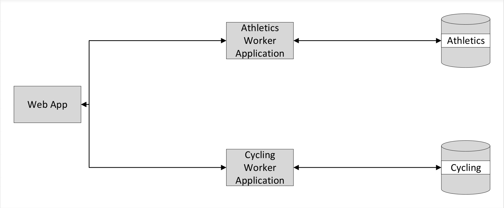
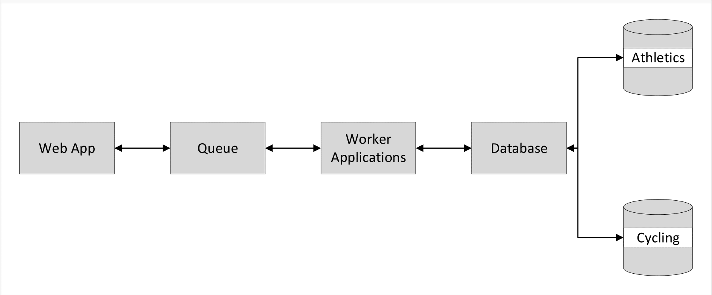
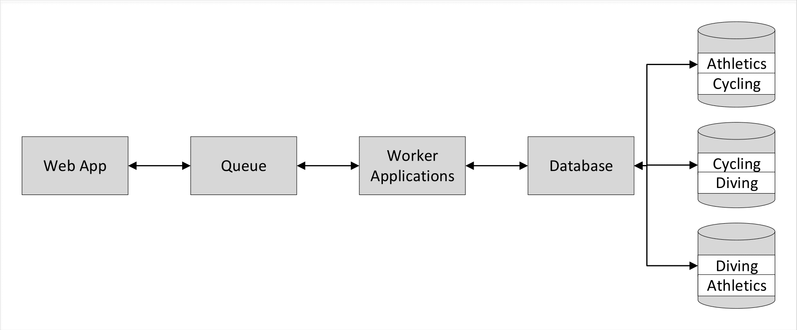
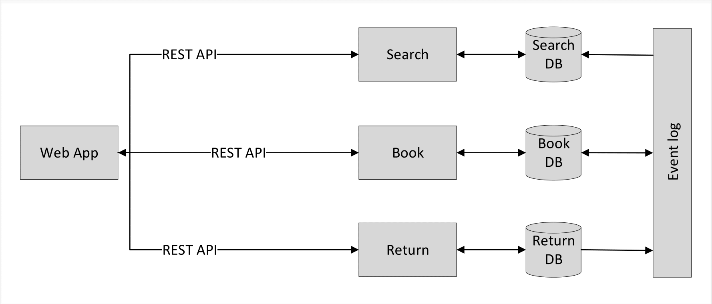

# Performance modelling and simulation of skewed demand in complex systems

Platform decisions:

* Build the applications on Microsoft Azure
* Use an Azure Storage Queue for the shared queue
* Use Cassandra for the distributed database
* Develop in AngularJS and Java Spring
* Use [JMeter](http://jmeter.apache.org/ "JMeter") for load testing

## Plan outline

Build [PEPA models](/Models/ "Models") for components of the architectures.

* Distributed DB
* Distributed DB with replication
* Shared middleware queue

Compose the PEPA component models into system models for microservices and shared queue architectures for a multi-tier OLTP application, using the example of Olympic ticketing.

Build the applications for those architectures and instrument them to measure throughput.
Test the models against the real applications under different scenarios of skewed demand.

* Build model
* Build application
* Instrument application
* Measure and test model

### Model 1 - simple microservices

There are two separate DBs, one for Cycling tickets, one for Cycling.  Athletics will have skewed demand.

It's expected that this architecture will lead to isolation of the skewed demand and that the results of testing the model will not be surprising, but that this will provide a useful control for other architectures.

### Model 2 - shared queue middleware

Requests via a shared queue to worker applications going to a distributed DB with two nodes, Athletics and Cycling.

### Model 3 - distributed DB with replication

Requests via a shared queue to worker applications going to a distributed database with three nodes, Athletics, Cycling and Diving, where each partition is replicated on another node.

## Suggestions for future work using the models:

### Priority queues

As 'shared queue middleware' but more than queue, e.g. by priority.

### Database distributions

Modelling different database distribution and replication strategies.

### Operational microservices

A more 'natural' microservices architecture.  Seperate DBs by operation (Book, Search, Return) plus DB eventual consistency via event streaming e.g. using Kafka.

`Book` is an event producer and consumer (produces when a ticket is booked, consumes returned tickets).

`Search` is an event consumer (consumes the state of tickets that are booked and returned).

`Return` is an event producer (produces returned tickets).

### Smaller microservices

For example, breaking down the `Book` operation further by sport.

* Book Athletics
* Book Cycling
* Search
* Return